<div align="center">
  
</div>

<div align="center">

```
╔══════════════════════════════════════════════════════╗
║   SAVE FILE FOUND: devansh.sav                       ║
║   Location: Bangalore · Playtime: 4+ years           ║
║   Last checkpoint: Founding Engineer @ fireplace.gg  ║
╚══════════════════════════════════════════════════════╝
```

**This README is a game. Click each ▶ to play. Every level unlocks the next one.**

</div>

<details>
<summary><b>▶ LEVEL 1 · Wake up</b></summary>
<br />

> *You wake up in a dark room. A single terminal is glowing. Someone left a note on the keyboard: "type whoami".*

```console
devansh@bangalore:~$ whoami
frontend engineer who treats latency like a personal insult.
builds real-time apps, tools other devs build on,
and the tiny details nobody notices until they're missing.
```

🏆 **Achievement unlocked:** *Hello, World*

<details>
<summary><b>▶ LEVEL 2 · Open the inventory</b></summary>
<br />

> *Your backpack is heavier than expected. Most of it is TypeScript.*

<p align="left">
  
</p>

```text
EQUIPPED   ⚔️  Strict TypeScript      +40 sanity
           🛡️  Optimistic UI          blocks 100% of spinners
           💍  Ring of WebSockets     reconnects... eventually
```

🏆 **Achievement unlocked:** *Fully Typed*

<details>
<summary><b>▶ LEVEL 3 · Boss fight</b></summary>
<br />

> *The ground shakes. A wild **LATENCY** appears!*

```text
LATENCY ████████████████████  HP 400ms

What will you do?
  ▸ Add a loading spinner        ✗  "It's not very effective..."
  ▸ Blame the backend            ✗  "The backend blamed you back."
  ▸ Optimistic update + memo     ✓  "It's super effective!"

LATENCY ░░░░░░░░░░░░░░░░░░░░  HP 0ms   ✦ defeated ✦
```

🏆 **Achievement unlocked:** *Sub-100ms or It Didn't Happen*

<details>
<summary><b>▶ LEVEL 4 · The secret room</b></summary>
<br />

> *Behind a cracked wall, you find a dusty scroll of forbidden opinions.*

```diff
+ hover states are a love language
+ if a tool is annoying to use, that's a bug
+ dark mode ships before the README
- `any` is a cry for help
- meetings that could have been a PR comment
```

> *There's also a sticky note:* "my day job is prediction markets. odds I say *'just one more refactor'* this week: **94¢**"

🏆 **Achievement unlocked:** *Hot Take Collector*

<details>
<summary><b>▶ FINAL LEVEL · Co-op mode</b></summary>
<br />

> *A door opens. On the other side: you. Every good game is better in co-op.*

<div align="center">

<a href="https://www.linkedin.com/in/devansh-shukla-433956169"></a>
<a href="https://devansh.site"></a>
<a href="mailto:shukladevansh007@gmail.com"></a>

```text
★ ★ ★  GAME COMPLETE  ★ ★ ★
  You found every level. Most visitors don't.
  Send me "1-1" and I'll know you made it.
```

🏆 **Achievement unlocked:** *100% Completion*

</div>

</details>
</details>
</details>
</details>
</details>

<br />

<div align="center">

### 🐍 Bonus level · a snake eats my commits every night

<picture>
  <source media="(prefers-color-scheme: dark)" srcset="https://raw.githubusercontent.com/Devansh252/Devansh252/output/github-contribution-grid-snake-dark.svg" />
  
</picture>

<br />


</div>
